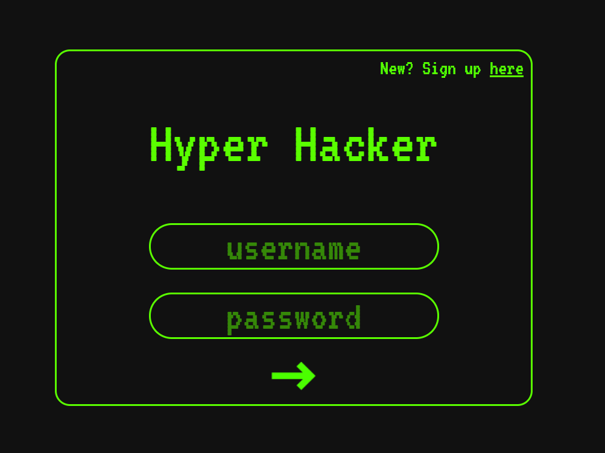

# Hyper Hacker

Hyper Hacker is a Full Stack web application that allows anyone to become a hacker. Users will take full advantage of the web inspector and console to hack their way through 10 challenges. [Put your hacking skills to the test!](https://hyper-hacker.herokuapp.com/)

## Technologies Used
- Node.js
- Express
- MongoDB
- Redis
- React
- Three.js
- WebVR

## Background
This project was developed at RIT by Dan Singer and Emily Turner.